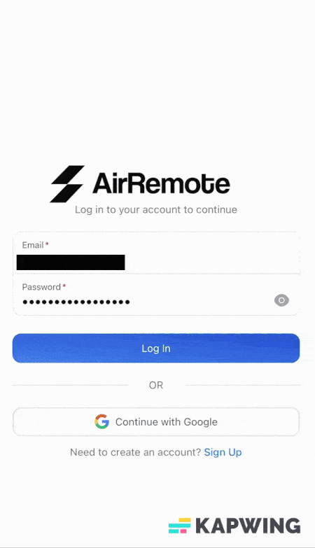
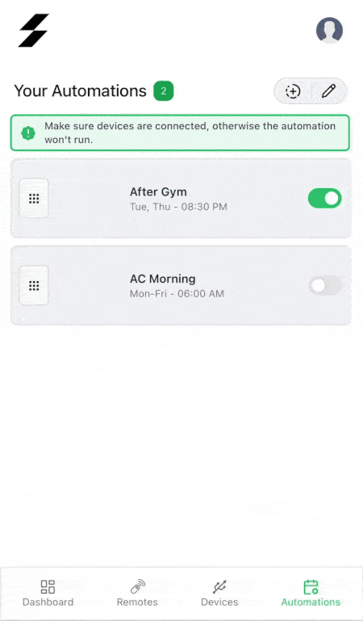

<p align="center">
  
  
</p>
<h2 align="center">AirRemote Backend Repository ⚡</h2>
<p align="center">
    <a href="/LICENSE"></a>
    <a href="https://github.com/jugeekuz/AirRemote-Frontend/graphs/contributors"></a>
    <a href="https://www.linkedin.com/in/anastasiosdiamantis"></a>
</p><br>

Turn your old remote-controlled devices into smart devices! With AirRemote, you can turn any legacy device that can be controlled by an IR remote, into a remotely accesible smart device.

<p align="center">
    
</p>


--- 
## 📝  Description


AirRemote is a solution designed to modernize legacy remote-controlled devices by making them smart and remotely accessible. AirRemote operates as a universal remote emulator. It works by capturing the infrared (IR) signals from any remote control—regardless of how rare or obscure—and storing them for later use. You can then replay those commands remotely through the web interface (or through automated routines) enabling you to perform actions such as open the A/C or your heater on your way back, finding your house in the perfect temperature when you arrive, or just keep all your remotes in one place without needing to search for them every time.

## 🔧 Features 
- Record the IR signals by simply pressing the buttons of their existing remote control onto the AirRemote device.
- Replay the stored signals on command via a web interface.
- Create automations to perform a set of operations (such as open lighting, A/C etc.) at specific times.
- Give the device to a friend, with the capability to initialize the device and provide credentials through a Captive Portal interface.
- Manage, Delete, Reorder your favourite devices through the web interface.

With these capabilities, AirRemote turns virtually any device with an IR remote into a smart, remotely controllable appliance.

<!-- ## 🎥 Demo
<div align="center">
    <table>
    <tr>
        <td>
            <div style="flex: 0 0 300px;">
                <h4>Login & Dashboard</h4>
                
            </div>
        </td>
        <td>
            <div style="flex: 0 0 300px;">
                <h4>Add Remote and Execute</h4>
                
            </div>
        </td>
    </tr>
    <tr>
        <td>
            <div style="flex: 0 0 300px;">
                <h4>Create Automations</h4>
                
            </div>
        </td>
        <td>
            <div style="flex: 0 0 300px;">
                <h4>Register Devices</h4>
                
            </div>
        </td>
    </tr>
    <tr>
        <td>
            <div style="flex: 0 0 300px;">
                <h4>Reorder & Edit tiles</h4>
                
            </div>
        </td>
    </tr>
    </table>
</div> -->

## 🌟 Project Overview

The **AirRemote** project is divided into three main components. Each part contains instructions on how to deploy / install it:

- [**Embedded Device:**](https://github.com/jugeekuz/AirRemote-Embedded) 
    - A C/C++ PlatformIO project, involving ESP32-based unit with an IR receiver and 8 powerful IR blasters. It records IR signals from any remote control and replays them across the room, enabling universal compatibility.
    
- [**Serverless Backend (This Repository):**](https://github.com/jugeekuz/AirRemote-Backend) 
    - A Python project using Serverless framework to deploy a scalable AWS-based backend powered by Lambda, DynamoDB, API Gateway, and EventBridge. It ensures secure command storage, user authorization, and efficient routing between the web interface and devices.

- [**Frontend :**](https://github.com/jugeekuz/AirRemote-Frontend) 
    - A React JS project providing an application for managing devices, saving IR commands, authenticating users and creating powerful automation routines—all accessible through a sleek web interface.

---

## ⚙️ Installation and deployment
### 📦 Prerequisites

1. Make sure you have npm 10.0+ installed.
    ```bash
    npm -v
    ```

2. Make sure you have [AWS CLI](https://docs.aws.amazon.com/cli/latest/userguide/getting-started-install.html) installed and configured:
    ```bash
    aws --v
    aws s3 ls
    ```

3. Make sure you have [pip](https://pypi.org/project/pip/) installed in your system.
    ```bash
    pip --version
    ```

4. Make sure you have [Serverless Framework v3.39](https://www.serverless.com/) installed and credentials configured with correct permissions in AWS in your system.
    ```bash
    serverless -v
    ```

### 🚀 Deployment to AWS

1. #### Clone this repository:
    ```bash
    git clone https://github.com/jugeekuz/AirRemote-Backend
    ```
2. #### Install deployment dependencies:
    ```bash
    npm install
    ```
3. #### Install environment dependencies:
    ```bash
    pip install -r requirements.txt -t ./src/vendor
    ```
4. #### First deployment
    - In `config.json` update `<AWS_REGION>` to your region id.
    - Deploy once initially, without configuring anything else, we will redeploy later.
        ```bash
        serverless deploy
        ```
5. #### Create Cognito Domain
    1. Get the User Pool id:
    ```bash
    aws cognito-idp list-user-pools
    ```
    2. Create User Pool Domain:
    ```bash
    aws cognito-idp create-user-pool-domain --user-pool-id <your-user-pool-id> --domain <your-domain-prefix>
    ```
6. #### Update the `config.json`
    Update the config.json with:
    - `<CORS_ORIGIN>` - Your domain name `https://example.com`
    - `<COGNITO_DOMAIN>` - Your cognito domain `https://<YOUR_DOMAIN_PREFIX>.auth.eu-central-1.amazoncognito.com`
    - `<ADMIN_EMAIL>` - Your email you'll register on the app with. (For a user to be registered he has to be invited to the app and new users can be invited through the web interface)
    - `<AWS_REGION>` - Your region id (you should have changed this in previous part)

7. #### Final deployment
    ```bash
    serverless deploy
    ```
8. #### Configure Social Sign On (Google) - optional
    1. Go to [Google Cloud Console](https://console.cloud.google.com/cloud-resource-manager) -> Create Project -> Name Project -> Create.
    2. On the Navigation bar to the left press `APIs and Services` -> Credentials -> Create Credentials -> OAuth Client ID
    3. Press `Configure Consent Screen`-> External (you can change this later for production) and fill the following:
        - `App name` - Your app name
        - `User support email` - Your email
        - `App logo` - Your app logo (optional)
        - `Application home page` - Your domain name `https://example.com`
        - `Authorised domains` - Your domain name (without "https://")
        - `Developer contact information` - Your e-mail
    4. Finish creating and add test user under `OAuth consent screen`
    5. Go back to `APIs and Services` -> Credentials -> Create Credentials -> OAuth Client ID -> Web application -> Next
    6. Under `Authorized JavaScript origins` add :
        ```text
        https://<YOUR-DOMAIN-NAME>
        https://<YOUR-DOMAIN-PREFIX>.auth.eu-central-1.amazoncognito.com`
        ```
    7. Under `Authorised redirect URIs` add: 
        ```text
        https://<YOUR-DOMAIN-PREFIX>.auth.eu-central-1.amazoncognito.com/oauth2/idpresponse
        ```
    8. Save and keep the `Client ID` and `Client secret`.
    9. Go to AWS Cognito -> User Pools -> YourUserPool -> Social and external providers -> Add identity provider -> Google
    10. Under `Client ID`, `Client secret` enter the values from previous step.
    ``
    11. Under `Authorized scopes` enter:
    ```text
    openid profile email
    ```
    12. Map attributes between Google and your user pool:
     - `email` - `email`
     - `nickname` - `name`
     - `username` - `sub`

9. #### Update environment file and go to Frontend deployment
 - Update `<YOUR-APP-CLIENT-ID>` w/ your Cognito App Client Id and `<YOUR-COGNITO-DOMAIN>` with your Cognito domain.
 - Place it in the root folder of the [Frontend](https://github.com/jugeekuz/AirRemote-Frontend) and continue with the deployment of the frontend.
---

## 📜 License
Licensed under the GPL V3.0 License.
<a href="https://github.com/jugeekuz/AirRemote-Embedded/blob/master/LICENSE">🔗 View License Details </a>

---

## 🤝 Contributing
Feel free to fork the repository and contribute! Pull requests and feedback are welcome.

